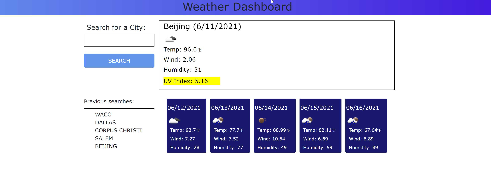

# TITLE: WEATHER DASHBOARD

## Project Title: weather-dashboard
Purpose: This project was created to continue to explore JavaScript & jQuery while exploring 3rd party APIs, specifically making requests with parameters to a URL to access data/funcitonality from 3rd party systems.

The project is a browser based weather dashboard that utilizes data pulled from OpenWeather to retrieve weather data for multiple cities.

**Creation date:** June 2021  
**Collaborators:** Sheri Elgin

## Screen Cap


## Project Links
GitHub Source Code: https://github.com/grudgecat/weather-dashboard  
Site URL/Pages link: https://grudgecat.github.io/weather-dashboard/

***
## Dependencies 
**jQuery:** 
Project webpage: https://jquery.com/  
To include in project file:  
```
<script src="https://cdnjs.cloudflare.com/ajax/libs/jquery/3.2.1/jquery.min.js"></script>
```

**Bootstrap:** 
Project webpage: https://getbootstrap.com/  
To include in project file:
```
<link
  rel="stylesheet"
  href="https://stackpath.bootstrapcdn.com/bootstrap/4.3.1/css/bootstrap.min.css"
/>
```
**Moment.js:** \
Project webpage: https://momentjs.com/  
To include in project file:
```
<script src="https://cdnjs.cloudflare.com/ajax/libs/moment.js/2.24.0/moment.min.js"></script>
```
**APIs:**
Data obtained from OpenWeather One Call API: [OpenWeather One Call API](https://openweathermap.org/api/one-call-api) 
```

***
## Expected Behavior 
GIVEN a weather dashboard with form inputs
WHEN I search for a city
THEN I am presented with current and future conditions for that city and that city is added to the search history
WHEN I view current weather conditions for that city
THEN I am presented with the city name, the date, an icon representation of weather conditions, the temperature, the humidity, the wind speed, and the UV index
WHEN I view the UV index
THEN I am presented with a color that indicates whether the conditions are favorable, moderate, or severe
WHEN I view future weather conditions for that city
THEN I am presented with a 5-day forecast that displays the date, an icon representation of weather conditions, the temperature, the wind speed, and the humidity
WHEN I click on a city in the search history
THEN I am again presented with current and future conditions for that city.
